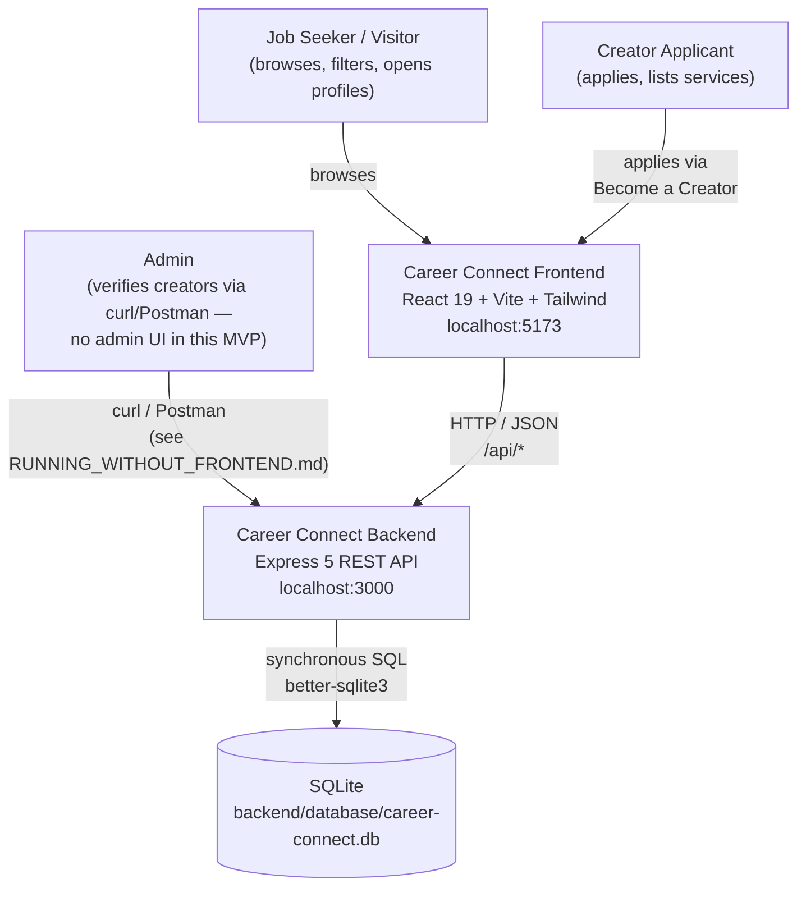
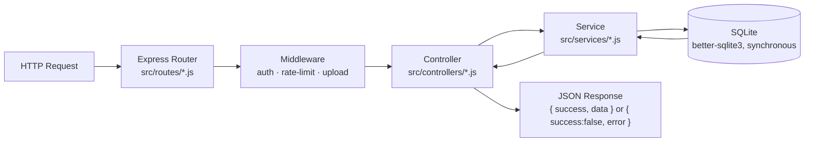
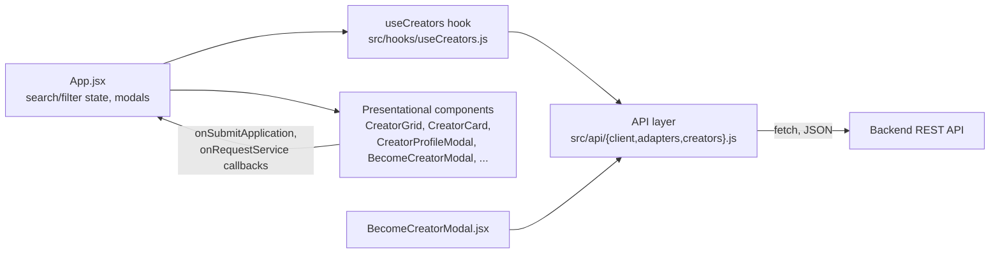
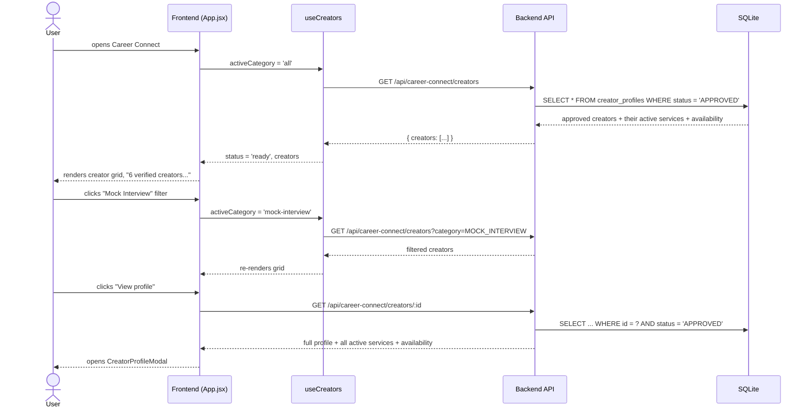
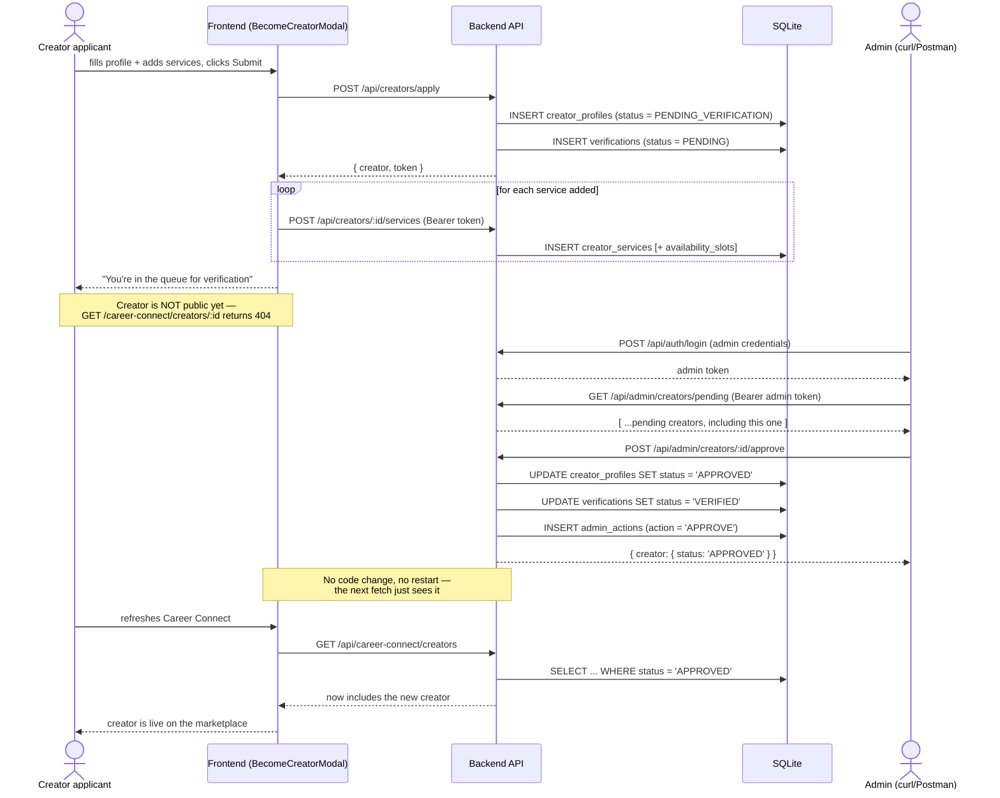
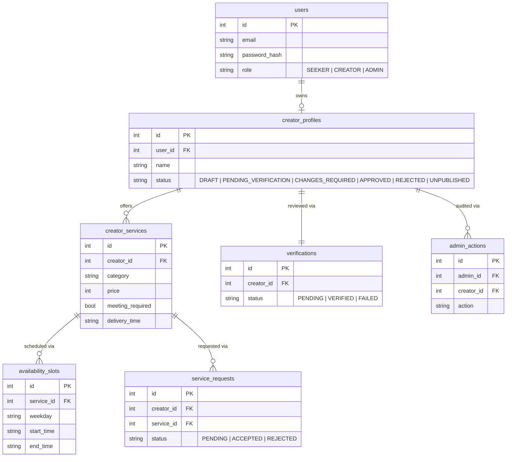
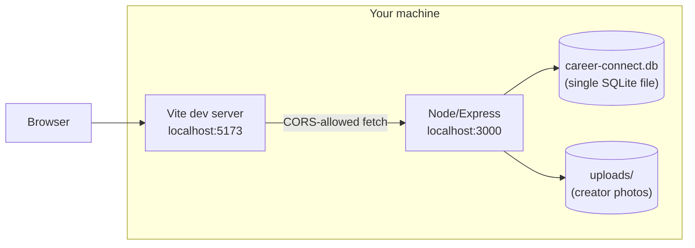

# Career Connect — System Architecture

One diagram-first document covering how the frontend, backend, and database
fit together, and how data flows through the two core scenarios: browsing
the marketplace, and a creator going from application to public visibility.

For deeper detail on any one layer, see:
[docs/API.md](API.md) (endpoint contract) ·
[docs/DATABASE.md](DATABASE.md) (schema) ·
[backend/README.md](../backend/README.md) (backend internals) ·
[frontend/README.md](../frontend/README.md) (frontend internals)

---

## 1. System context

Three kinds of people use the product; all of them go through the same
frontend, which talks to one backend, which is the only thing that touches
the database.

**Why the admin has no UI:** the PRD scopes the public marketplace and
creator application as the frontend's job; the admin panel is called out as
"a separate, internal-facing surface" (see [PRODUCT_AND_SERVICES.md](PRODUCT_AND_SERVICES.md#admin-verification)).
The backend's admin API is fully built and tested — it's just driven directly
for this MVP rather than through a second UI. `docs/RUNNING_WITHOUT_FRONTEND.md`
is the operator's manual for that.

---

## 2. Backend architecture

Every request follows the same one-directional pipeline — no framework
magic, no hidden layers:

| Layer | Owns | Never does |
|---|---|---|
| **Routes** (`src/routes/`) | URL + HTTP method → controller, wiring middleware (auth/rate-limit) | Business logic, SQL |
| **Controllers** (`src/controllers/`) | Reads `req`, calls one service function, shapes the response | Talks to the database directly |
| **Services** (`src/services/`) | All business logic and SQL, via `better-sqlite3` | Knows about `req`/`res` |
| **Middleware** (`src/middleware/`) | JWT auth, role checks, rate limiting, file upload validation, error → JSON translation | — |
| **db** (`src/db/`) | Connection, schema, setup/seed scripts | — |

Full breakdown of every file: [backend/README.md § Folder-by-folder guide](../backend/README.md#folder-by-folder-guide).

---

## 3. Frontend architecture

The frontend never talks to `fetch` outside of `src/api/`:

| File | Responsibility |
|---|---|
| `src/api/client.js` | `apiRequest()` — wraps `fetch`, unwraps the backend's response envelope, throws a typed `ApiError` |
| `src/api/adapters.js` | Translates backend `UPPER_SNAKE_CASE` enums / snake_case fields ↔ the frontend's slug-based category ids / camelCase fields — the **one** place that mapping lives |
| `src/api/creators.js` | The actual endpoint calls: list/profile fetch, apply, create service, service request |
| `src/hooks/useCreators.js` | Fetches the public marketplace (re-fetching on category change), exposes `{ creators, status, error }` |

Because the API layer returns data already shaped like the original mock
data, almost none of the presentational components (`CreatorCard`,
`ServiceCard`, `CreatorProfileModal`, etc.) needed to change when the mock
data was replaced with live fetches. Full file-by-file breakdown:
[frontend/README.md § Project structure](../frontend/README.md#project-structure).

---

## 4. Scenario: browsing the marketplace

The `WHERE status = 'APPROVED'` clause is the load-bearing line in this
whole diagram — it's enforced in SQL, not by anything the frontend has to
remember to check.

---

## 5. Scenario: creator application → admin approval → public visibility

This is the flow the PRD calls "the core 'wow, it actually works'
demonstration." It spans both the frontend (application) and the backend's
admin API (verification, driven manually per `RUNNING_WITHOUT_FRONTEND.md`
since there's no admin UI in this MVP).

---

## 6. Data model

Column-by-column reference: [docs/DATABASE.md](DATABASE.md).

**Note the direction of the two FKs from `availability_slots` and
`creator_services`:** availability belongs to a *service*, not to a
creator — a single creator can offer Consultation on Wednesday evenings and
Mock Interviews on Saturday mornings, each with its own independent
schedule. This is a PRD requirement, not an implementation shortcut.

---

## 7. Deployment shape (local MVP)

There is no cloud infrastructure in this MVP — it's two local processes and
one file:

- No Docker, no external database server, no cloud services — see
  [docs/DECISIONS.md](DECISIONS.md) for why.
- CORS is locked to `FRONTEND_URL` (backend `.env`), which must match the
  Vite dev server's actual origin.
- Full setup instructions for running both halves together: **[docs/RUNNING_THE_MVP.md](RUNNING_THE_MVP.md)**.
